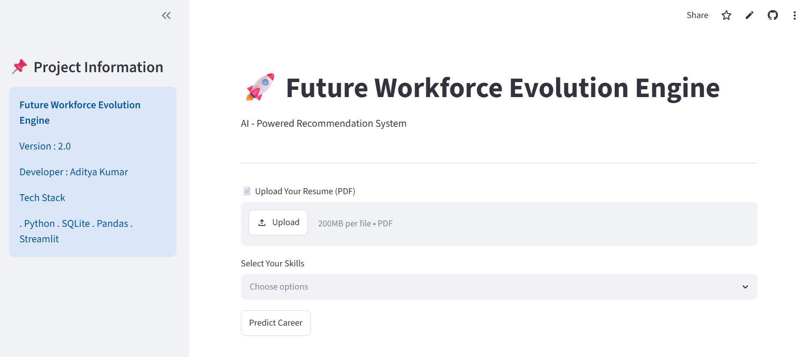
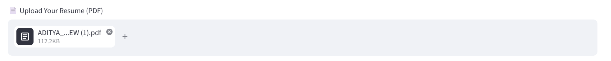
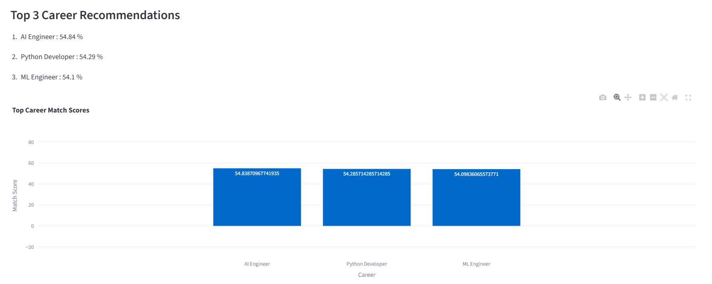
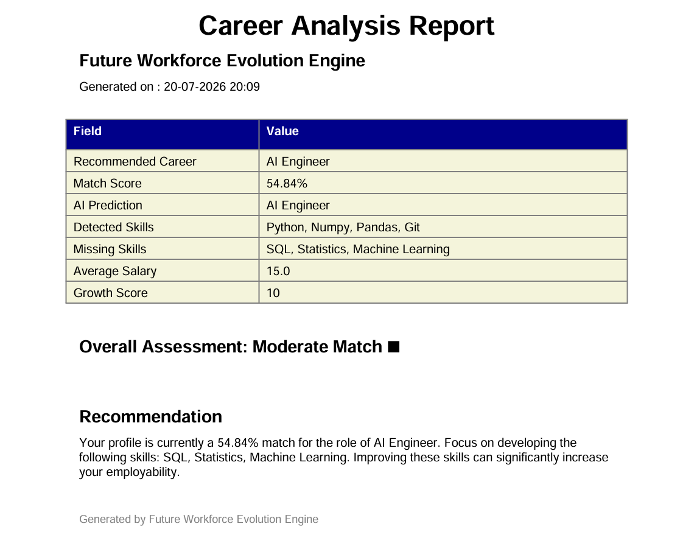

# 🚀 Future Workforce Evolution Engine

> **An AI-Powered Career Recommendation System that combines Rule-Based Intelligence and Machine Learning to analyze user skills, recommend suitable career paths, identify skill gaps, and generate personalized career reports.**


---

# 🌐 Live Demo

**🔗 Live Application**

> https://future-workforce-evolution-engine.streamlit.app/

---

# 📖 Project Overview

Future Workforce Evolution Engine is an AI-powered career intelligence platform that helps users discover the most suitable career based on their technical skills.

The application combines a **Weighted Rule-Based Recommendation Engine** with a **Machine Learning Classification Model** to provide intelligent career recommendations.

Users can upload their resume or manually select skills. The system extracts skills automatically, compares them with industry role requirements, predicts the most suitable career, identifies missing skills, generates a personalized learning roadmap, and allows downloading a professional PDF Career Report.

The project demonstrates the integration of:

- Rule-Based Expert Systems
- Machine Learning
- Resume Parsing
- Data Visualization
- Interactive Web Applications
- Career Analytics

---

# ✨ Key Features

## 🎯 Career Recommendation

- ✅ Weighted Skill Matching Algorithm
- ✅ Best Career Recommendation
- ✅ Top 3 Career Recommendations
- ✅ Career Match Score

---

## 🤖 Artificial Intelligence

- ✅ Machine Learning Career Prediction
- ✅ AI Confidence Score
- ✅ Rule-Based vs ML Comparison

---

## 📄 Resume Intelligence

- ✅ Resume Upload (PDF)
- ✅ Automatic Resume Parsing
- ✅ Automatic Skill Detection
- ✅ Manual Skill Selection (Fallback)

---

## 📊 Career Analytics

- ✅ Missing Skills Detection
- ✅ Personalized Learning Roadmap
- ✅ Salary Insights
- ✅ Career Growth Score
- ✅ Automation Risk Analysis

---

## 📈 Interactive Dashboard

- ✅ Streamlit Web Application
- ✅ Progress Indicators
- ✅ Gauge Chart
- ✅ Pie Chart
- ✅ Bar Chart
- ✅ Interactive Visualizations

---

## 📄 Report Generation

- ✅ Professional PDF Career Report
- ✅ Downloadable Analysis Report

---

## 🗄 Database

- ✅ SQLite Database
- ✅ Skills Database
- ✅ Career Roles Database
- ✅ Skill Weight Mapping

---

# 🛠 Technology Stack

| Category | Technologies |
|----------|--------------|
| Programming | Python |
| Machine Learning | Scikit-learn |
| Database | SQLite |
| Data Processing | Pandas, NumPy |
| Visualization | Plotly |
| Web Framework | Streamlit |
| Resume Parsing | pdfplumber |
| PDF Report | ReportLab |
| Model Serialization | Joblib |

---

# 🧠 Core Modules

The application consists of multiple independent modules:

- Resume Parsing Engine
- Skill Detection Engine
- Weighted Recommendation Engine
- Machine Learning Prediction Engine
- Career Analytics Engine
- Learning Roadmap Generator
- PDF Report Generator
- Interactive Dashboard

---

# 📂 Project Structure

```text
Future-Workforce-Evolution-Engine
│
├── data/
│   ├── raw/
│   └── processed/
│
├── database/
│   └── workforce.db
│
├── models/
│   ├── career_model.pkl
│   └── label_encoder.pkl
│
├── src/
│   ├── app.py
│   ├── skill_match_engine.py
│   ├── resume_parser.py
│   ├── pdf_report.py
│   ├── load_skills.py
│   ├── load_roles.py
│   ├── load_skills_roles.py
│   └── visualization.py
│
├── requirements.txt
├── README.md
├── LICENSE
└── .gitignore
```

---

# 🗄 Database Schema

The recommendation engine is powered by a relational SQLite database.

| Table | Description |
|--------|-------------|
| **skills** | Stores all technical skills |
| **roles** | Stores available career roles |
| **skills_roles** | Maps required skills with importance weights |
| **employees** | Employee dataset used for ML training |

The weighted relationship between skills and roles enables realistic career recommendations rather than simple keyword matching.

---

# ⚙️ Recommendation Workflow

```text
                     USER
                      │
                      ▼
        Resume Upload / Manual Skills
                      │
          ┌───────────┴───────────┐
          ▼                       ▼
 Resume Parsing           Manual Skill Selection
          │                       │
          └───────────┬───────────┘
                      ▼
           Automatic Skill Detection
                      │
                      ▼
           Skill ID Conversion
                      │
                      ▼
             SQLite Database
                      │
                      ▼
        Required Skill Retrieval
                      │
                      ▼
      Weighted Skill Matching Engine
                      │
          ┌───────────┴────────────┐
          ▼                        ▼
 Rule-Based Prediction      ML Prediction
          │                        │
          └───────────┬────────────┘
                      ▼
          Career Recommendation
                      │
                      ▼
      Missing Skills Identification
                      │
                      ▼
      Personalized Learning Roadmap
                      │
                      ▼
         Salary • Growth • AI Risk
                      │
                      ▼
       Interactive Streamlit Dashboard
                      │
                      ▼
       Professional PDF Career Report
```

---

# 🧠 Recommendation Algorithm

The recommendation engine follows these steps:

1. Accept user skills or uploaded resume.
2. Extract technical skills automatically.
3. Convert detected skills into database Skill IDs.
4. Retrieve required skills for every career.
5. Compare user skills with required role skills.
6. Calculate weighted match scores.
7. Predict career using Machine Learning.
8. Compare Rule-Based and ML predictions.
9. Recommend the most suitable career.
10. Identify missing skills.
11. Generate personalized learning roadmap.
12. Display analytics dashboard.
13. Generate downloadable PDF report.

---

# 📐 Weighted Match Score

The recommendation engine calculates the career match score using weighted skills.

```text
Match Score

=

(Total Matched Skill Weight
──────────────────────────────) × 100
(Total Required Skill Weight)
```

Higher weighted skills contribute more to the final recommendation, making the prediction more realistic than simple keyword matching.

---

# 📊 Dashboard Features

The interactive Streamlit dashboard provides:

- 🎯 Best Career Recommendation
- 🤖 Machine Learning Prediction
- 📈 AI Confidence Score
- 📊 Top 3 Career Recommendations
- 📉 Career Match Visualization
- 🥧 Skill Distribution Chart
- 📚 Missing Skills
- 📖 Personalized Learning Roadmap
- 💰 Salary Insights
- 📈 Career Growth Score
- ⚠️ Automation Risk
- 📄 Downloadable PDF Report

---

# 🚀 Installation

Clone the repository

```bash
git clone https://github.com/YOUR_USERNAME/Future-Workforce-Evolution-Engine.git
```

Move into the project directory

```bash
cd Future-Workforce-Evolution-Engine
```

Install dependencies

```bash
pip install -r requirements.txt
```

Run the application

```bash
streamlit run src/app.py
```

Open your browser

```text
http://localhost:8501
```

---

# ▶️ How to Use

### Option 1 — Upload Resume

- Upload your resume in PDF format.
- The application automatically extracts technical skills.
- Click **Generate Recommendation**.
- View AI predictions and download the PDF report.

---

### Option 2 — Manual Skill Selection

- Select your skills manually.
- Generate recommendations.
- Compare Rule-Based and Machine Learning predictions.
- Explore missing skills and learning roadmap.

---

# 📸 Application Screenshots


### 🏠 Home Page

```
<p align="center">
  
</p>
```

---

### 📄 Resume Upload

```
<p align="center">
  
</p>
```

---

### 📊 Recommendation Dashboard

```
<p align="center">
  
</p>
```

---

### 📑 PDF Career Report

```

<p align="center">
  
</p>

---

# 💡 Skills Demonstrated

This project demonstrates practical experience in:

### Programming

- Python

### Machine Learning

- Classification Models
- Model Serialization
- Prediction Pipeline

### Data Engineering

- SQLite Database Design
- SQL Queries
- Data Processing

### Data Analysis

- Pandas
- NumPy

### Data Visualization

- Plotly Interactive Charts

### Web Development

- Streamlit

### Resume Intelligence

- PDF Parsing
- Automatic Skill Extraction

### Software Engineering

- Modular Project Structure
- Clean Code Organization
- Git & GitHub
- Deployment on Streamlit Community Cloud

---

# 🎯 Learning Outcomes

Through this project, I gained hands-on experience in:

- Building an end-to-end AI-powered application
- Designing relational databases
- Implementing rule-based recommendation systems
- Developing machine learning prediction pipelines
- Parsing PDF resumes
- Creating interactive dashboards
- Generating automated PDF reports
- Deploying production-ready applications using Streamlit Cloud
- Organizing scalable Python projects

---

# 🚀 Future Enhancements

The project will continue evolving with additional capabilities such as:

- Authentication & User Accounts
- Resume Ranking System
- LinkedIn Profile Analysis
- Job Recommendation Engine
- Real-Time Job Market Trends
- Online Course Recommendations
- Skill Gap Forecasting
- Career Demand Prediction
- Cloud Database Integration (PostgreSQL)
- LLM-powered Career Guidance
- Resume Improvement Suggestions

---

# 📈 Project Highlights

- ✅ End-to-End Machine Learning Project
- ✅ Rule-Based + ML Hybrid Recommendation System
- ✅ Resume Parsing & Skill Extraction
- ✅ Interactive Web Dashboard
- ✅ Career Analytics
- ✅ Professional PDF Report Generation
- ✅ SQLite Database Integration
- ✅ Plotly Data Visualization
- ✅ Streamlit Cloud Deployment
- ✅ Modular & Scalable Codebase

---

# 📌 Repository Statistics

**Project Type**

Career Recommendation System

**Development Status**

Completed (Version 2.0)

**Language**

Python

**Database**

SQLite

**Deployment**

Streamlit Community Cloud

**License**

MIT License

---

# 🤝 Contributing

Contributions are welcome!

If you'd like to improve this project:

1. Fork the repository
2. Create a new feature branch
3. Commit your changes
4. Push your branch
5. Open a Pull Request

---

# 👨‍💻 Author

## Aditya Kumar

**B.Tech – Electronics & Communication Engineering**

Birla Institute of Technology Mesra

### Connect with Me

**GitHub**

https://github.com/adityakumar45127

**LinkedIn**

www.linkedin.com/in/aditya-kumar45127

**Email**

adityakumar45127@gmail.com

---

# 📄 License

This project is licensed under the MIT License.

Feel free to use, modify, and distribute this project for educational and research purposes.

---

# 🙏 Acknowledgements

This project was inspired by the growing need for intelligent career guidance systems that combine rule-based reasoning with machine learning.

Special thanks to the open-source Python ecosystem, including:

- Python
- Streamlit
- Scikit-learn
- Pandas
- Plotly
- ReportLab
- pdfplumber
- SQLite

for making rapid development of intelligent applications possible.

---

# ⭐ Support

If you found this project useful,

please consider giving it a ⭐ on GitHub.

It helps increase the visibility of the project and motivates further development.

---

## Thank You ❤️

Thank you for visiting this repository.

Feedback, suggestions, and contributions are always appreciated.

Happy Coding! 🚀